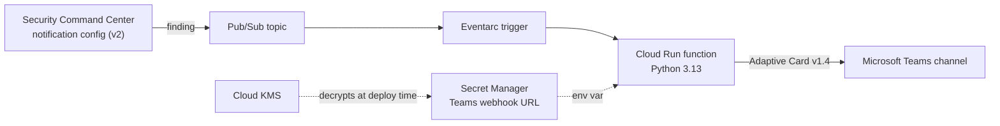

<div align="center">

# 🛡️ Security Command Center findings to Microsoft Teams

**Real-time Google Cloud Security Command Center alerts in your Microsoft Teams security channel.**


</div>

Security Command Center (SCC) publishes active, unmuted HIGH and CRITICAL findings to a Pub/Sub topic. A Cloud Run function formats each finding with a Microsoft Teams Adaptive Card (v1.4) and posts it to your security channel via a Teams Workflows or Incoming Webhook URL. Everything is deployed with Terraform.

### What a notification looks like

#### 1️⃣ Exploitable CVE Alert with GTI Vulnerability Intelligence (`CVE-2021-44228` Log4Shell)

<table>
  <thead>
    <tr>
      <th colspan="2" align="left">
        🛡️ <b>SCC Security Notifier</b> &nbsp; &nbsp;<code>General / security-gcp-alerts</code> &nbsp;•&nbsp; <sub>16:50 UTC</sub>
      </th>
    </tr>
  </thead>
  <tbody>
    <tr>
      <td colspan="2">
        A new security finding has been identified: <a href="#-message-content"><b>[WIDE EXPLOIT | CRITICAL IMPACT] CVE-2021-44228 (SOFTWARE_VULNERABILITY)</b></a>
      </td>
    </tr>
    <tr>
      <td width="72%" valign="top">
        <b>Project:</b> <code>example-project-01</code> &nbsp;&nbsp;|&nbsp;&nbsp; <b>Resource:</b> <code>java-api-prod-01</code><br/>
        <b>Severity:</b> <b>CRITICAL</b> 🚨 &nbsp;&nbsp;|&nbsp;&nbsp; <b>State:</b> <code>ACTIVE</code><br/>
        <b>Event time:</b> <code>2026-09-25T16:50:00.000Z</code>
      </td>
      <td width="28%" align="right" valign="middle">
        <a href="https://console.cloud.google.com/security/command-center/findingsv2"></a>
      </td>
    </tr>
    <tr>
      <td colspan="2">
        <b>CVE:</b> <a href="https://nvd.nist.gov/vuln/detail/CVE-2021-44228">CVE-2021-44228</a> &nbsp;|&nbsp; <a href="https://console.cloud.google.com/security/command-center/findingsv2">View Org-Wide in SCC</a><br/>
        <b>Exploitability:</b>  &nbsp;|&nbsp; <b>Impact:</b> <br/>
        <b>CVSSv3:</b> <code>10.0</code> &nbsp;|&nbsp; <b>Upstream Fix:</b> Yes ✅
      </td>
    </tr>
    <tr>
      <td colspan="2">
        <b>🔎 Google Threat Intelligence (GTI) Verdict:</b><br/>
        • <b>GTIG Vulnerability Assessment:</b> <a href="https://www.virustotal.com/gui/collection/vulnerability--cve-2021-44228"><code>CVE-2021-44228</code></a> — 🔴 <b>CRITICAL RISK</b> &nbsp;  <br/>
        • <b>Threat Telemetry:</b> EPSS: <code>100.00% (100th pct)</code> &nbsp;|&nbsp; CISA KEV: <code>Yes</code>, Ransomware: <code>Known</code> &nbsp;|&nbsp; Mitigations: <code>Patch, Workaround, Intrusion Prevention Signatures, Firewall</code><br/>
        • <b>GTIG Summary:</b> <i>An Input Validation vulnerability exists that, when exploited, allows a remote attacker to execute arbitrary code. This vulnerability has been confirmed to be widely exploited in the wild...</i>
      </td>
    </tr>
    <tr>
      <td colspan="2">
        <b>Recommendation:</b><br/>
        Upgrade package <code>org.apache.logging.log4j:log4j-core</code> to <code>2.17.1</code>.
      </td>
    </tr>
  </tbody>
</table>

#### 2️⃣ Threat Alert with GTI IoC Enrichment ([Disrupting GRIDTIDE / UNC2814 Espionage Campaign](https://cloud.google.com/blog/topics/threat-intelligence/disrupting-gridtide-global-espionage-campaign))

<table>
  <thead>
    <tr>
      <th colspan="2" align="left">
        🛡️ <b>SCC Security Notifier</b> &nbsp; &nbsp;<code>General / security-gcp-alerts</code> &nbsp;•&nbsp; <sub>15:45 UTC</sub>
      </th>
    </tr>
  </thead>
  <tbody>
    <tr>
      <td colspan="2">
        A new security finding has been identified: <a href="#-message-content"><b>Malware: GRIDTIDE Backdoor &amp; SoftEtherVPN C2 (UNC2814)</b></a>
      </td>
    </tr>
    <tr>
      <td width="72%" valign="top">
        <b>Project:</b> <code>telecom-prod-01</code> &nbsp;&nbsp;|&nbsp;&nbsp; <b>Resource:</b> <code>edge-gateway-01</code><br/>
        <b>Severity:</b> <b>CRITICAL</b> 🚨 &nbsp;&nbsp;|&nbsp;&nbsp; <b>State:</b> <code>ACTIVE</code><br/>
        <b>Event time:</b> <code>2026-09-25T15:45:00.000Z</code>
      </td>
      <td width="28%" align="right" valign="middle">
        <a href="https://console.cloud.google.com/security/command-center/findingsv2"></a>
      </td>
    </tr>
    <tr>
      <td colspan="2">
        <b>🔎 Google Threat Intelligence (GTI) Verdict:</b><br/>
        <b>Campaign Attribution:</b> <a href="https://cloud.google.com/blog/topics/threat-intelligence/disrupting-gridtide-global-espionage-campaign">Disrupting GRIDTIDE Global Espionage Campaign (UNC2814)</a><br/>
        • <b>IP:</b> <a href="https://www.virustotal.com/gui/ip-address/130.94.6.228"><code>130.94.6.228</code></a> — 🔴  &nbsp;<sub>ASN: <code>LIGHT NODE LIMITED, VN</code></sub><br/>
        • <b>Hostname:</b> <a href="https://www.virustotal.com/gui/domain/1cv2f3d5s6a9w.ddnsfree.com"><code>1cv2f3d5s6a9…free.com</code></a> — 🔴 <br/>
        • <b>SHA256:</b> <a href="https://www.virustotal.com/gui/file/ce36a5fc44cbd7de947130b67be9e732a7b4086fb1df98a5afd724087c973b47"><code>ce36a5fc44cb…7c973b47</code></a> — 🔴 <br/>
        • <b>IP:</b> <a href="https://www.virustotal.com/gui/ip-address/38.60.194.21"><code>38.60.194.21</code></a> — 🔴  &nbsp;<sub>ASN: <code>LIGHT NODE LIMITED, MY</code></sub>
      </td>
    </tr>
    <tr>
      <td colspan="2">
        <b>Explanation:</b><br/>
        Detected execution of <code>/var/tmp/xapt</code> (GRIDTIDE backdoor) and SoftEtherVPN bridge outbound C2 traffic associated with the UNC2814 / GRIDTIDE global espionage campaign.<br/><br/>
        <b>Recommendation:</b><br/>
        Isolate the compromised workload immediately, revoke Google Service Account tokens used for Google Sheets C2 exfiltration, and block the C2 IPs and dynamic DNS hostnames.
      </td>
    </tr>
  </tbody>
</table>

<details>
<summary><b>▶️ Replay these exact demo messages in your own Microsoft Teams channel (1 command)</b></summary>

You can post either demo notification directly into a real Microsoft Teams channel from your terminal using `--send`:

```bash
# Replay Demo 1: Log4Shell (CVE-2021-44228) to Microsoft Teams (with optional GTI_API_KEY)
TEAMS_WEBHOOK_URL="https://your-teams-webhook-url" \
GTI_API_KEY=your_optional_gti_key \
python3 app/scc-finding-teams-notifications/main.py tests/fixtures/vuln_v2_log4shell_cve_2021_44228.json --send

# Replay Demo 2: UNC2814 / GRIDTIDE Espionage Campaign to Microsoft Teams (with optional GTI_API_KEY)
TEAMS_WEBHOOK_URL="https://your-teams-webhook-url" \
GTI_API_KEY=your_optional_gti_key \
python3 app/scc-finding-teams-notifications/main.py tests/fixtures/etd_v2_gridtide_espionage.json --send
```
</details>

<table>
  <thead>
    <tr>
      <th colspan="3" align="center">
        💡 <b>Note: Google Threat Intelligence (GTI) Enrichment is Optional</b> &nbsp;
      </th>
    </tr>
  </thead>
  <tbody>
    <tr>
      <td width="33%" valign="top">
        ✅ <b>Works Out-of-the-Box</b><br/>
        <sub>GTI enrichment is <b>100% optional</b>. Without a GTI key, the pipeline sends all SCC &amp; CVE alerts normally and automatically omits the GTI verdict block.</sub>
      </td>
      <td width="34%" valign="top">
        🔑 <b>GTI API Key Required</b><br/>
        <sub>To enable the live CVE &amp; IoC verdicts shown in the demos above, provide a GTI API key via <code>gti_api_key_ciphertext</code> (Terraform) or <code>GTI_API_KEY</code> (CLI).</sub>
      </td>
      <td width="33%" valign="top">
        💬 <b>Want to Test It?</b><br/>
        <sub><i>If you want to test the additional Google Threat Intelligence enrichment, feel free to reach out to me!</i></sub>
      </td>
    </tr>
  </tbody>
</table>

### Quick start

```bash
# 1. Stage 1: KMS key for the Microsoft Teams webhook URL
cd infra/kms && cp terraform.tfvars.example terraform.tfvars   # edit
terraform init && terraform apply

# 2. Encrypt the Microsoft Teams webhook URL
read -rs TEAMS_WEBHOOK_URL && export TEAMS_WEBHOOK_URL
terraform output -raw encrypt_command | sh && unset TEAMS_WEBHOOK_URL

# 3. Stage 2: the notifier
cd .. && cp terraform.tfvars.example terraform.tfvars          # edit, paste the ciphertext
terraform init && terraform apply
```

See [Deployment](#-deployment) for the full steps and required permissions.

## Contents

- [Features](#-features)
- [Architecture](#-architecture)
- [Repository layout](#-repository-layout)
- [Prerequisites](#-prerequisites)
- [Deployment](#-deployment)
- [Configuration](#-configuration)
- [Message content](#-message-content)
- [Error handling and monitoring](#-error-handling-and-monitoring)
- [Development](#-development)
- [Operations](#-operations)
- [Security considerations](#-security-considerations)
- [Troubleshooting](#-troubleshooting)

## ✨ Features

- **Organization-wide real-time alerts.** Uses the SCC v2 notification API (`google_scc_v2_organization_notification_config`) across the entire GCP organization.
- **High-signal CVE filtering.** Automatically restricts `VULNERABILITY` CVE findings to those with **`WIDE`, `AVAILABLE`, or `CONFIRMED` exploitability** and **`CRITICAL` or `HIGH` impact**, eliminating Microsoft Teams noise from thousands of unexploited CVEs while preserving all other active `CRITICAL` and `HIGH` findings (`THREAT`, `MISCONFIGURATION`, `TOXIC_COMBINATION`, and non-CVE vulnerabilities).
- **Organization-wide CVE burst deduplication.** Suppresses repeated Microsoft Teams alerts for the same CVE across all projects in the organization within a configurable cooldown window (`cve_dedup_window_seconds`).
- **Optional Google Threat Intelligence (GTI) enrichment.** When a GTI API key is provided (`gti_api_key_ciphertext` / `GTI_API_KEY`), the function enriches **CVEs** (GTIG risk rating, priority, exploitation state, consequence, EPSS, CISA KEV, mitigations, and executive summary) and **IoCs** (IPs, domains/hostnames, and SHA-256 hashes with detection ratios and campaign context) directly in Microsoft Teams. Works seamlessly out-of-the-box without a GTI key.
- **Full-width Adaptive Cards (v1.4).** Shows category, project, resource, severity, state, event time, and CVE metadata (Exploitability, Impact, CVSSv3 score, Upstream Fix status, and NVD/Organization-wide SCC links), with an `Action.OpenUrl` button that opens the finding in the Cloud Console. Compatible with both Microsoft Teams **Workflows** (Power Automate) and **Incoming Webhooks**.
- **All finding sources.** Security Health Analytics findings show their explanation and recommendation. Threat detection findings show their description and next steps. Vulnerability findings automatically recommend the fixed package version when available.
- **Optional project allowlist.** By default, alerts cover the entire organization (`allowed_projects = []`), with optional filtering for specific projects.
- **Safe retries.** Transient errors are retried and permanent errors are logged once, so a broken or revoked webhook URL never causes endless retries.
- **Encrypted secret handling.** The Microsoft Teams webhook URL is committed only as KMS ciphertext (`cryptoKeyEncrypter` / `cryptoKeyDecrypter`) and delivered to the function through Secret Manager.
- **Least privilege.** Separate service accounts for build and runtime, with IAM scoped to the key, secret and function.

## 🏗️ Architecture



Deployment happens in two Terraform stages:

1. **Stage 1** in [infra/kms/](infra/kms/) creates the KMS key that encrypts the Microsoft Teams webhook URL.
2. **Stage 2** in [infra/](infra/) creates the topic, SCC notification config, secret, service accounts and function.

## 📁 Repository layout

| Path | Purpose |
|---|---|
| [infra/kms/](infra/kms/) | Stage 1 Terraform: KMS key ring and crypto key. |
| [infra/](infra/) | Stage 2 Terraform: the notifier. |
| [app/scc-finding-teams-notifications/](app/scc-finding-teams-notifications/) | Function source and the Microsoft Teams Adaptive Card template. |
| [tests/](tests/) | Unit tests and sample SCC notifications. |

## ✅ Prerequisites

- Terraform 1.9 or newer and the gcloud CLI.
- SCC activated at organization level.
- A Google Cloud project to host the notifier. A dedicated security project is recommended.
- A Microsoft Teams team and channel where you can configure a Workflows webhook or Incoming Webhook.

The identity that runs Terraform needs:

| Role | Scope | Why |
|---|---|---|
| `roles/securitycenter.notificationConfigEditor` | Organization | Create the SCC notification config. |
| `roles/pubsub.admin` | Project | Lets SCC grant its service agent publish rights on the topic. |
| `roles/owner`, or equivalent rights to enable APIs and manage IAM, service accounts, functions, secrets and buckets | Project | Deploy the notifier. |
| `roles/iam.serviceAccountUser` | The two service accounts Terraform creates | Deploy the function as those identities. |
| `roles/cloudkms.cryptoKeyDecrypter` | KMS key | Decrypt the webhook URL. Stage 1 grants it through `decrypter_members`. |

## 🚀 Deployment

### 1. Create the Microsoft Teams channel webhook

1. In Microsoft Teams, open the target security channel, click **More options (`•••`)** next to the channel name, and select **Workflows**.
2. Choose the template **Post to a channel when a webhook request is received**.
3. Give the workflow a name (for example, `SCC Security Notifier`), confirm the team and channel, and click **Add workflow**.
4. Copy the generated **HTTPS webhook URL** (it contains the shared-secret signature in the URL, so treat it as a secret credential).

### 2. Create the KMS key

```bash
cd infra/kms
cp terraform.tfvars.example terraform.tfvars   # fill in project_id and members
terraform init
terraform apply
```

The key has `prevent_destroy` set, because destroying it makes the stored ciphertext unrecoverable.

### 3. Encrypt the Microsoft Teams webhook URL

Still in `infra/kms`, run the generated `encrypt_command`. This reads the webhook URL without echoing it or saving it to shell history:

```bash
read -rs TEAMS_WEBHOOK_URL && export TEAMS_WEBHOOK_URL
terraform output -raw encrypt_command | sh
unset TEAMS_WEBHOOK_URL
```

The output is a single line of base64 ciphertext.

### 4. Deploy the notifier

```bash
cd ../   # infra/
cp terraform.tfvars.example terraform.tfvars
```

Fill in `terraform.tfvars`:

- `org_id` and `project_id`.
- `kms_crypto_key_id` from the stage 1 output `crypto_key_id`.
- `teams_webhook_url_ciphertext`. Replace the placeholder `REPLACE-WITH-KMS-CIPHERTEXT-OF-TEAMS-WEBHOOK-URL` with the ciphertext from step 3. Terraform refuses to plan while the placeholder is still there.

> [!IMPORTANT]
> The webhook URL is encrypted in your Terraform code and variables, but Terraform stores the decrypted URL in state. Configure the commented `gcs` backend in [infra/versions.tf](infra/versions.tf) on a bucket with restricted access before the first apply.

Then deploy:

```bash
terraform init
terraform plan
terraform apply
```

### 5. Test end to end

Publish a sample notification to the topic and check the Microsoft Teams channel:

```bash
gcloud pubsub topics publish scc-findingsnotifier-topic \
  --project=PROJECT_ID \
  --message="$(cat tests/fixtures/sha_private_google_access.json)"
```

For a real finding in your organization, check that the **View in Cloud Console** button opens the finding.

## ⚙️ Configuration

Stage 2 variables are set in `infra/terraform.tfvars`.

<details>
<summary><b>All stage 2 variables</b></summary>

| Variable | Default | Description |
|---|---|---|
| `org_id` | required | Numeric organization ID. |
| `project_id` | required | Project that hosts the notifier. |
| `kms_crypto_key_id` | required | Output `crypto_key_id` of stage 1. |
| `teams_webhook_url_ciphertext` | required | Base64 KMS ciphertext of the Microsoft Teams webhook URL. |
| `gti_api_key_ciphertext` | `""` (optional) | Optional base64 KMS ciphertext of a Google Threat Intelligence (GTI) API key for CVE and IoC enrichment. Leave empty to run without GTI enrichment. |
| `region` | `europe-west1` | Region for the function, trigger and source bucket. |
| `notification_filter` | see below | Organization-wide SCC findings filter (includes CVE exploitability & impact rules). |
| `allowed_projects` | `[]` | Project IDs or display names to notify for. Empty means the entire organization. |
| `allowed_exploitability` | `["WIDE", "AVAILABLE", "CONFIRMED"]` | Allowed CVE `exploitationActivity` values for vulnerability alerts. |
| `allowed_cve_impact` | `["CRITICAL", "HIGH"]` | Allowed CVE `impact` ratings for vulnerability alerts. |
| `cve_dedup_window_seconds` | `3600` | Organization-wide cooldown window (seconds) to deduplicate repeated alerts for the same CVE. |
| `notification_config_id` | `scc-teams-notifier` | ID of the SCC notification config. |
| `topic_name` | `scc-findingsnotifier-topic` | Pub/Sub topic name. |
| `pubsub_allowed_persistence_regions` | `["europe-west1", "europe-west4"]` | Where Pub/Sub may store messages. |
| `secret_replica_locations` | `["europe-west1", "europe-west3"]` | Secret Manager replica locations. |
| `function_name` | `scc-teams-notifier` | Function name. |
| `function_runtime` | `python313` | Python runtime. |
| `max_instance_count` | `3` | Maximum function instances. Keep low to respect Microsoft Teams webhook rate limits. |
| `max_event_age_seconds` | `3600` | Events older than this are dropped instead of retried. |

</details>

Stage 1 variables are described in [infra/kms/variables.tf](infra/kms/variables.tf).

### Filtering findings

The default filter sends active, unmuted HIGH and CRITICAL findings across the organization, while restricting CVE `VULNERABILITY` findings to those with `WIDE`, `AVAILABLE`, or `CONFIRMED` exploitability and `CRITICAL` or `HIGH` impact:

```
(severity="HIGH" OR severity="CRITICAL") AND state="ACTIVE" AND -mute="MUTED" AND (finding_class!="VULNERABILITY" OR vulnerability.cve.id="" OR ((vulnerability.cve.exploitation_activity="WIDE" OR vulnerability.cve.exploitation_activity="AVAILABLE" OR vulnerability.cve.exploitation_activity="CONFIRMED") AND (vulnerability.cve.impact="CRITICAL" OR vulnerability.cve.impact="HIGH")))
```

The filter uses the same syntax as the SCC `findings.list` method. Always put parentheses around `OR` groups. Examples:

```
category="OPEN_FIREWALL" AND state="ACTIVE"
state="ACTIVE" AND -parent="organizations/ORG_ID/sources/SOURCE_ID"
```

The Cloud Run function also deduplicates repeated alerts for the same CVE across the organization within `cve_dedup_window_seconds` (default `3600` seconds). To notify only for specific projects, set `allowed_projects` (empty means the entire organization).

> [!WARNING]
> Create the notification config only through Terraform. A second config created with `gcloud scc notifications create` makes every finding post twice. Configs made with the v1 API are not visible in the v2 API, so find and delete old ones:
>
> ```bash
> gcloud scc notifications list --organization=ORG_ID
> gcloud scc notifications delete OLD_CONFIG_ID --organization=ORG_ID
> ```

## 💬 Message content

Each Adaptive Card message contains:

- A link to the finding with its category.
- The project, resource, severity, state and event time.
- A **View in Cloud Console** action button (`Action.OpenUrl`).
- CVE details (NVD link, organization-wide SCC link, Exploitability, Impact, CVSSv3 score, and Upstream Fix status) when the finding includes a CVE.
- **Optional Google Threat Intelligence (GTI) Verdict** for CVEs and IoCs when `GTI_API_KEY` is configured (automatically omitted when no GTI API key is set).
- Explanation and recommendation. Security Health Analytics provides these in `sourceProperties`. Threat detection findings use `description` and `nextSteps`.
- Exception instructions, when the finding provides them.

Sections without content are left out. Long sections are cut at 3000 characters so the card stays well within Microsoft Teams' payload limit. CRITICAL findings get a `🚨` emoji and HIGH findings get `⚠️`.

To change the layout, edit [finding-detail.json](app/scc-finding-teams-notifications/block_templates/finding-detail.json). The available placeholders are listed in `PLACEHOLDER_KEYS` in [main.py](app/scc-finding-teams-notifications/main.py).

## 📈 Error handling and monitoring

| Error type | Examples | Behaviour |
|---|---|---|
| Transient | Network failure, HTTP 429 or 5xx, Teams throttling or `service_unavailable` | Logged as WARNING and retried by Eventarc. |
| Permanent | HTTP 400/401/403/404, invalid webhook URL, invalid card payload, undecodable message | Logged as ERROR and not retried. |
| Too old | Event older than `max_event_age_seconds` | Logged as ERROR and dropped. |

Create a log-based alert on this query to catch permanent failures:

```
resource.type="cloud_run_revision"
resource.labels.service_name="scc-teams-notifier"
severity>=ERROR
```

Replace `scc-teams-notifier` if you changed `function_name`.

## 🧪 Development

Set up a virtual environment and run the tests:

```bash
python3 -m venv .venv && . .venv/bin/activate
pip install -r app/scc-finding-teams-notifications/requirements.txt pytest
pytest
```

Preview the Adaptive Card blocks for a sample notification without sending anything. The script works **without** a GTI API key (standard SCC + CVE output) or **with** `GTI_API_KEY` to include live **Google Threat Intelligence (GTI)** enrichment for **Log4Shell (`CVE-2021-44228`)** and the **[UNC2814 / GRIDTIDE Global Espionage Campaign](https://cloud.google.com/blog/topics/threat-intelligence/disrupting-gridtide-global-espionage-campaign)** *(Note: a GTI API key is required for the additional enrichment—if you want to test it, feel free to reach out to me)*:

```bash
# Run without GTI enrichment (works out-of-the-box without any API key):
python3 app/scc-finding-teams-notifications/main.py tests/fixtures/vuln_v2_log4shell_cve_2021_44228.json

# 1. Test Log4Shell (CVE-2021-44228) with live GTI CVE Risk, Priority (P0), Impact, EPSS & CISA KEV:
GTI_API_KEY=your_gti_api_key python3 app/scc-finding-teams-notifications/main.py tests/fixtures/vuln_v2_log4shell_cve_2021_44228.json

# 2. Test UNC2814 / GRIDTIDE Espionage Campaign IoCs (IPs, Hostnames, SHA-256) with live GTI verdicts:
GTI_API_KEY=your_gti_api_key python3 app/scc-finding-teams-notifications/main.py tests/fixtures/etd_v2_gridtide_espionage.json
```

Add `--send` to post the message to Microsoft Teams, using `TEAMS_WEBHOOK_URL` from your environment. Validate Terraform changes with:

```bash
terraform -chdir=infra fmt -check -recursive
terraform -chdir=infra init -backend=false && terraform -chdir=infra validate
```

## 🔧 Operations

### Rotating the Microsoft Teams webhook URL

1. Encrypt the new webhook URL as in [step 3](#3-encrypt-the-microsoft-teams-webhook-url).
2. Update `teams_webhook_url_ciphertext` and run `terraform apply`.
3. The function reads the `latest` secret version when an instance starts. Redeploy the function to pick up the new webhook URL immediately.

### Updating the function

Any change to the source code changes the zip hash, so `terraform apply` rebuilds and redeploys the function.

## 🔐 Security considerations

- **The webhook URL is encrypted in the Terraform code.** The repository and `terraform.tfvars` hold only KMS ciphertext. Only identities with `cryptoKeyDecrypter` on the key can decrypt it.
- **Terraform state still holds the plaintext webhook URL.** Terraform decrypts the ciphertext during apply and saves the result in state. Saved plan files from `terraform plan -out` contain it too. Use a remote backend with restricted access, and treat saved plan files as secrets.
- **The function is internal only.** Ingress is `ALLOW_INTERNAL_ONLY`, and only the trigger service account may invoke it.
- **Findings may be sensitive.** Post them to a private team or restricted channel with a limited audience.

## 🩺 Troubleshooting

<details>
<summary><b>Common problems and fixes</b></summary>

| Symptom | Likely cause | Fix |
|---|---|---|
| `Invalid value for variable` on plan | The webhook URL placeholder is still in `terraform.tfvars`. | Replace it with the ciphertext from step 3. |
| `PERMISSION_DENIED` on `google_kms_secret` | The Terraform identity cannot decrypt. | Add it to `decrypter_members` in stage 1 and apply. |
| `PERMISSION_DENIED` creating the notification config | Missing organization role. | Grant `roles/securitycenter.notificationConfigEditor` on the organization. |
| Log shows `HTTP 401` or `HTTP 403` | The webhook URL signature is wrong or revoked. | Recreate and rotate the webhook URL. |
| Log shows `HTTP 404` | The Teams workflow or incoming webhook was deleted or disabled. | Check the Workflows app in Microsoft Teams and update the webhook URL. |
| Every finding posts twice | A second notification config exists. | Delete the extra config, see [Filtering findings](#filtering-findings). |
| No messages at all | The filter matches nothing, or SCC is not activated for the organization. | Test with the Pub/Sub publish command in step 5, then relax the filter. |

</details>
